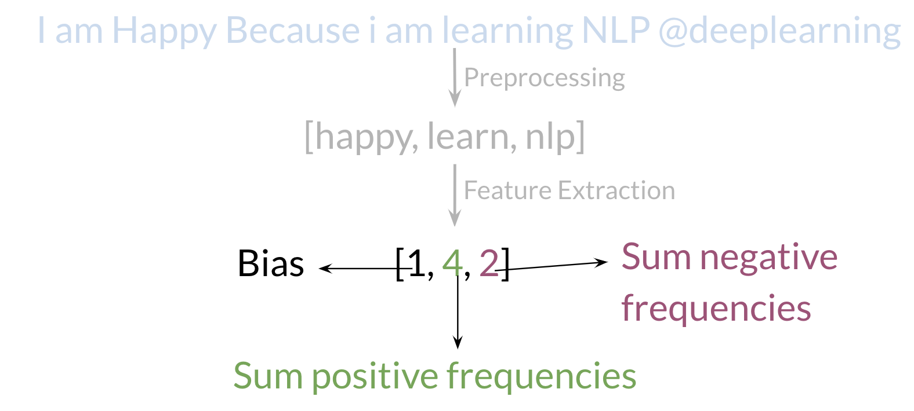
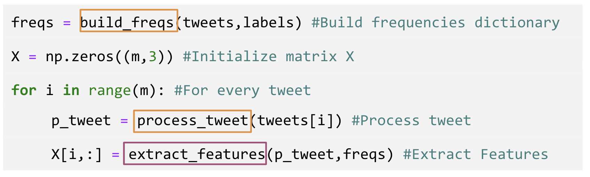
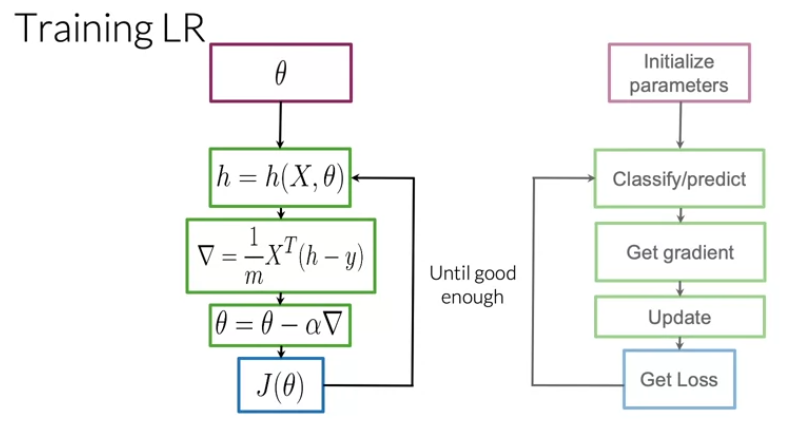
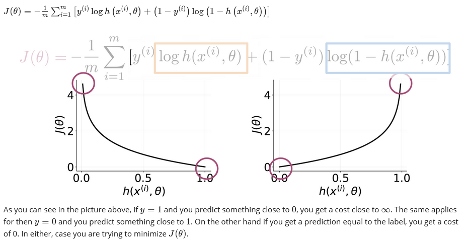
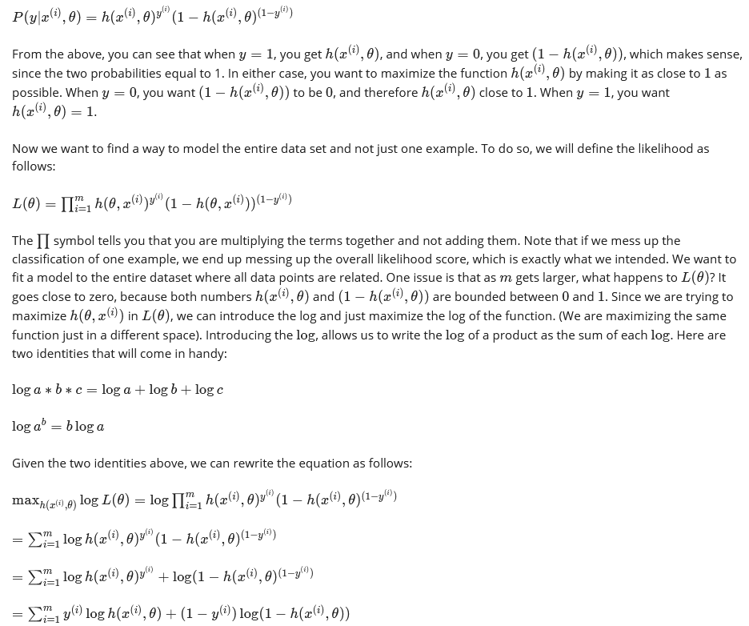
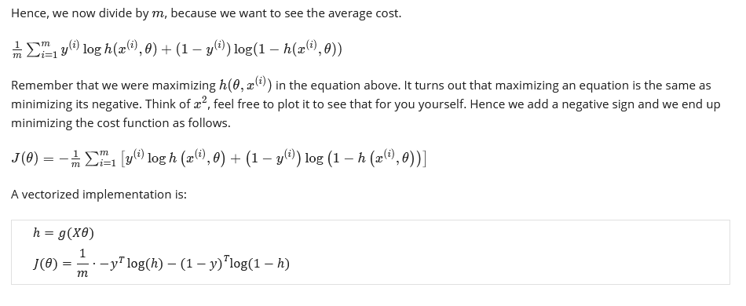
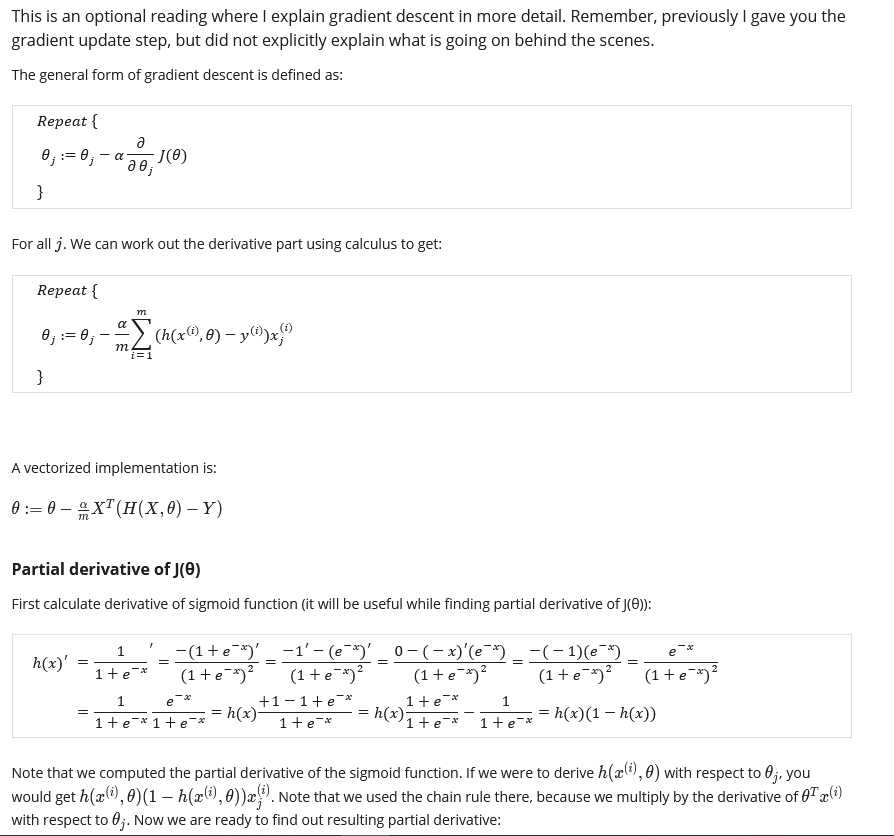
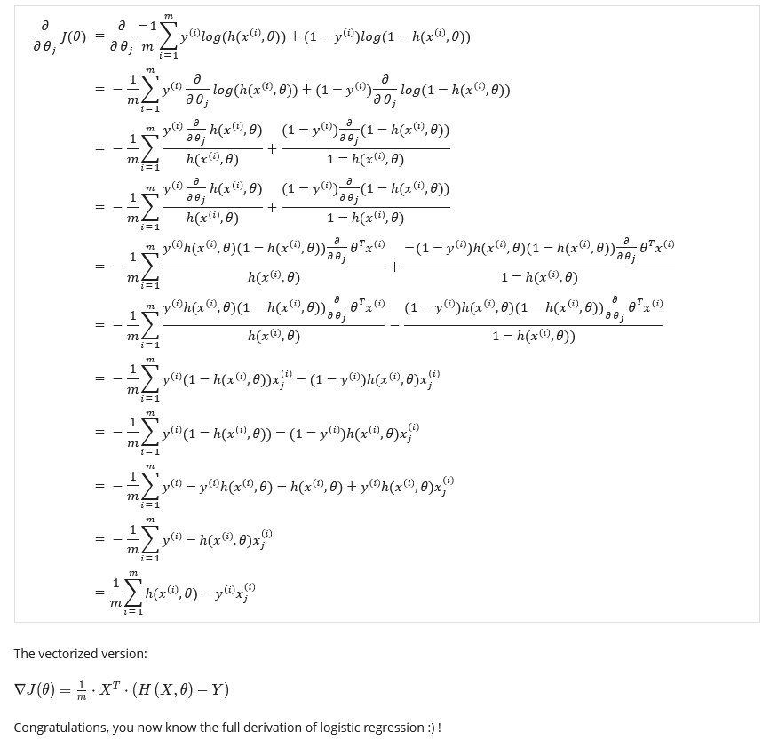

## Preprocessing

When preprocessing, you have to perform the following:

- Eliminate handles and URLs
- Tokenize the string into words.
- Remove stop words like "and, is, a, on, etc."
- Stemming- or convert every word to its stem. Like dancer, dancing, danced, becomes 'danc'. You can use porter stemmer to take care of this.
- Convert all your words to lower case.

For example the following tweet "@YMourri and @AndrewYNg are tuning a GREAT AI model at https://deeplearning.ai!!!" after preprocessing becomes: [tun,great,ai,model]

## Putting it all together

Over all , you start with a given text, you perform preprocessing, then you do feature extraction to convert text into numerical representation as follows:

## Logistic Regression: Training

Note: If you do not know what a gradient is, don't worry about it. I will show you what it is at then end of this week in an optional reading. In a nutshell, the gradient allows you to learn what $\theta$ is so that you can predict your tweet sentiment accurately.

Usually you keep training until the cost converges. If you were to plot the number of iterations versus the cost, you should see something like this:

## Logistic Regression: Cost Function

This is an advanced optional reading where we delve into the details.. If you do not get the math, do not worry about it - you will be just fine by moving onto the next component. In this part, I will tell you about the intuition behind why the cost function is designed the way it is. I will then show you how to derive the logistic regression cost function to get the gradients.

The logistic regression cost function is defined as

## Math Derivation

To show you why the cost function is designed that way, let us take a step back and write up a function that compresses the two cases into one case.

## Logistic Regression: Gradient

