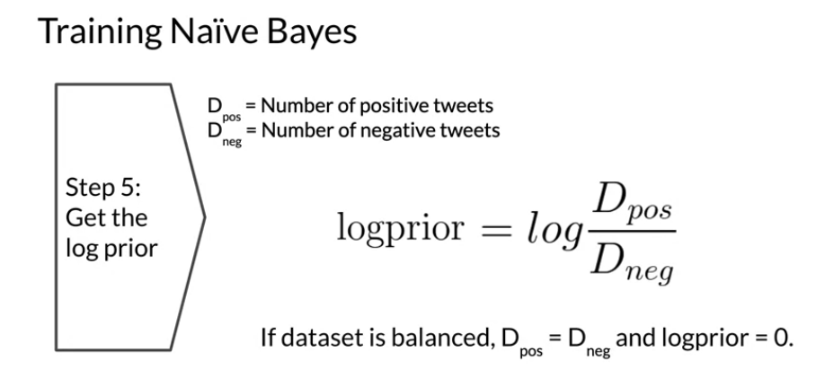

## Naive Bayes for sentiment Analysis

Carrying out such multiplications
on their computer runs the risk of
numerical underflow when the number returned
is so small it can't be stored on your device.
Luckily, there's a mathematical trick to solve this.
It involves using a property of logarithms.

## Training Naive Bayes

## Applications of Naive Bayes

There are many applications of naive Bayes including:

- Author identification
- Spam filtering
- Information retrieval
- Word disambiguation

This method is usually used as a simple baseline. It also really fast.

## Naïve Bayes Assumptions

Naïve Bayes makes the independence assumption and is affected by the word frequencies in the corpus. For example, if you had the following

In the first image, you can see the word sunny and hot tend to depend on each other and are correlated to a certain extent with the word "desert". Naive Bayes assumes independence throughout. Furthermore, if you were to fill in the sentence on the right, this naive model will assign equal weight to the words "spring, summer, fall, winter".

## Error Analysis

There are several mistakes that could cause you to misclassify an example or a tweet. For example,

- Removing punctuation
- Removing words
- Word order
- Adversarial attacks

These include sarcasm, irony, euphemisms.

