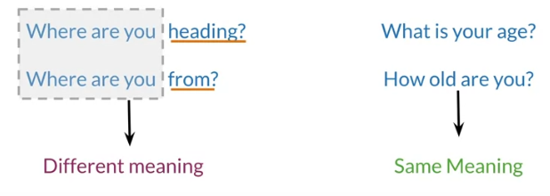
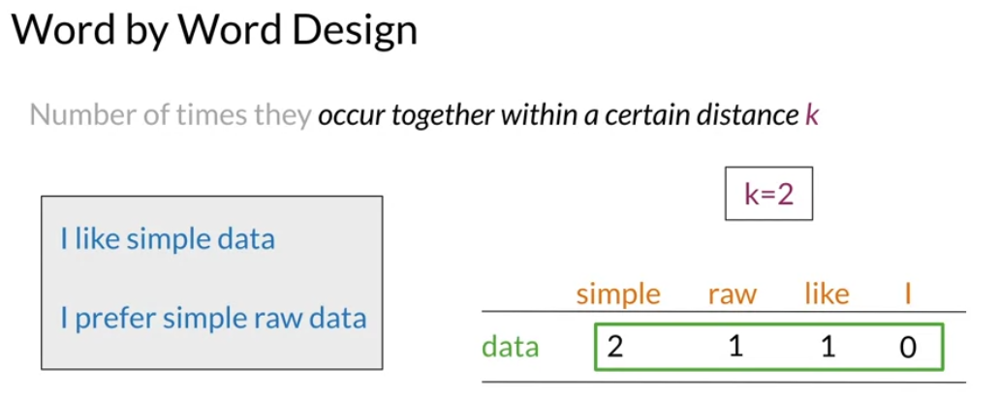
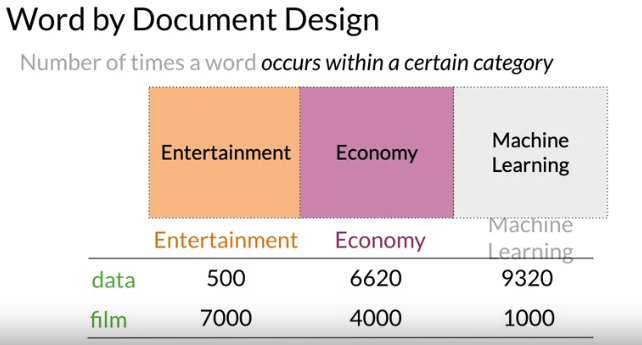
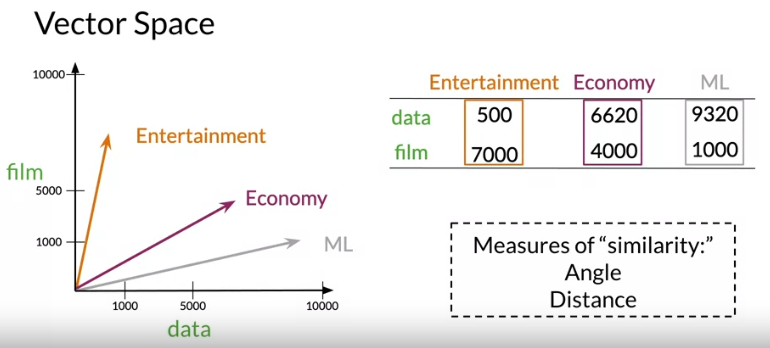
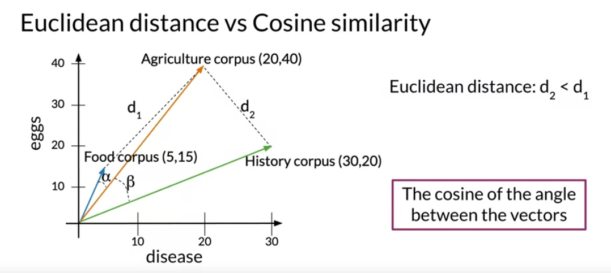
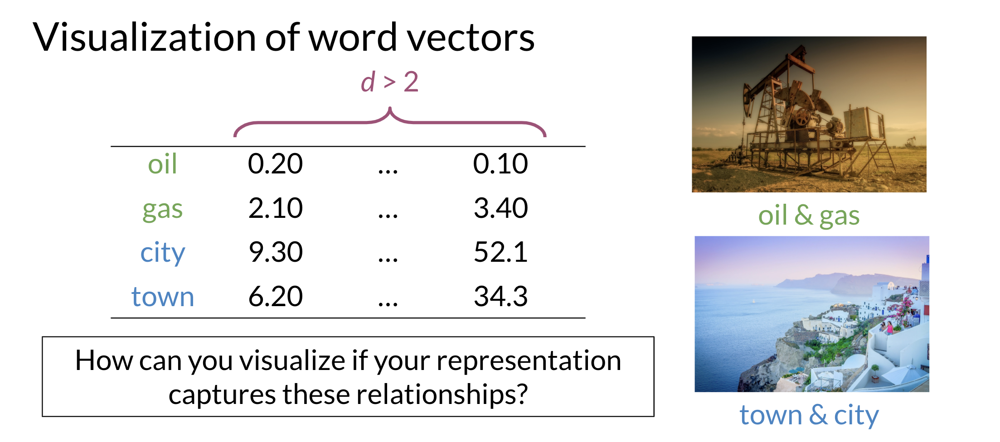
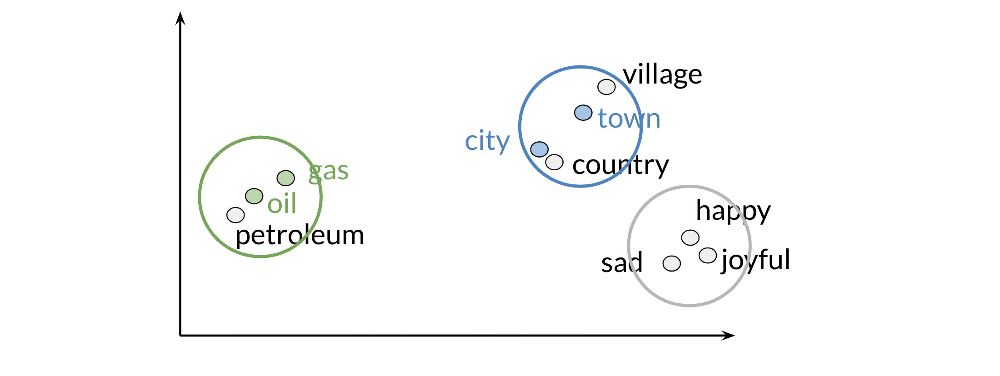
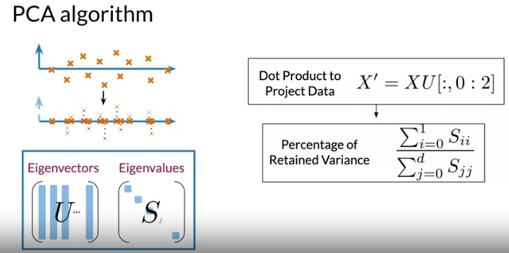

## Why learn vector space models?

Suppose you have two questions.
The first one is, "where are you heading?"
And the second one is, "where are you from?"

These sentences have identical words, except for the last ones.
However, they both have a different meaning. On the other hand, say you have two more questions whose words are completely different but both sentences mean the same thing.

Vector space models will help you identify whether the first pair of questions or the second pair are similar in meaning even if they do not share the same words. They can be used to identify similarity for a question answering, paraphrasing, and summarization.

Vector space models will also allow you to capture dependencies between words. Consider this sentence. "You eat cereal from a bowl". Here, you can see that the word "cereal" and the word "bowl" are related.

Vector space models are used in information extraction to answer
questions in the style of who, what, where, how, and
etc., in machine translation and in chatbots programming.

When using vector space models, the way that representations are made is by identifying the context around each word in the text, and
this captures the relative meaning. To recap, vector space models allow you to represent words and documents as vectors. This captures the relative meaning.

## Word by Word and Word by Doc

To get a vector space model using a word by word design,
you'll make a co-occurrence matrix and extract
vector presentations for the words in your corpus.
You'll be able to get a vector space model using
a word by document design using a similar approach.

The co-occurrence of two different words
is the number of times that they appear in
your corpus together within a certain word
distance k. For instance,

In this case, the vector representation of
the word data would be equal to $[2, 1, 1, 0]$.

For a word by document design,
the process is quite similar.
In this case, you'll count the times that words from
your vocabulary appear in
documents that belong to specific categories.
For instance, you could have a corpus consisting of
documents between different topics like entertainment,
economy, and machine learning.
Here, you'd have to
count the number of times that your words
appear on the document that
belong to each of the three categories.

So the vector space will have two dimensions.
The number of times that
the words data and film appear on the type of document.
For the entertainment corpus,
you'd have the following vector representation.
This one for the economy category,
and that for the machine learning category.
Note that in this space,
it is easy to see that
the economy and machine learning documents are much
more similar than they are to the entertainment category.
Coming up soon, you'll make
comparisons between vector representations using
the cosine similarity and
the Euclidean distance in order to
get the angle and distance between them.

So far, you've seen how to get
vector spaces by two different designs,
word by word and word by document,
by either counting the co-occurrence of words
or the co-occurrence of words in the document's corpora.
I also showed you that in vector spaces,
you can determine relationships between
types of documents like similarity.

## Cosine Similarity: Intuition

let the euclidean distance between the agriculture and the History corpus be d2.
As you can see, the distance d2 is smaller than the distance d1,
which would suggest that the agriculture and
history corpora are more similar than the agriculture and food corpora.
Another common method for determining the similarity between vectors
is computing the cosine of their inner angle.
If the angle is small, the cosine would be close to one.
And as the angle approaches 90 degrees, the cosine approaches zero.
As you can see here, the angle alpha between food and
agriculture is smaller than the angle beta between agriculture and history.
In this particular case,
the cosine of those angles is a better proxy of similarity between these
vector representations than their euclidean distance.

## Manipulating Words in Vector Spaces

The values from that will tell you
how many units on each dimension
you should move in order to find
a country's capital in that vector space.
So to find the capital city of Russia,
you will have to sum it's vector presentation
with the vector that you also got in the last step.
At the end, you should deduce that the capital of
Russia has a vector representation of 10, 4.
However, there are no cities with that representation,
so you'll have to take the one
that is the most similar to its by
comparing each vector with
the Euclidean distances or cosine similarities.
In this case, the vector
representation that is closest to the 10,
4 is the one for Moscow.
Using this simple process,
you could have predicted the capital of
Russia if you knew the capital of the USA.
The only catch here is that you need a vector space where
the representations
capture the relative meaning of words.

## Visualization and PCA

Principal component analysis is an unsupervised learning algorithm which can be used to reduce the dimension of your data. As a result, it allows you to visualize your data. It tries to combine variances across features. Here is a concrete example of PCA:

Note that when doing PCA on this data, you will see that oil & gas are close to one another and town & city are also close to one another. To plot the data you can use PCA to go from $d>2$ dimensions to $d=2$.

Those are the results of plotting a couple of vectors in two dimensions. Note that words with similar part of speech (POS) tags are next to one another. This is because many of the training algorithms learn words by identifying the neighboring words. Thus, words with similar POS tags tend to be found in similar locations. An interesting insight is that synonyms and antonyms tend to be found next to each other in the plot. Why is that the case?

