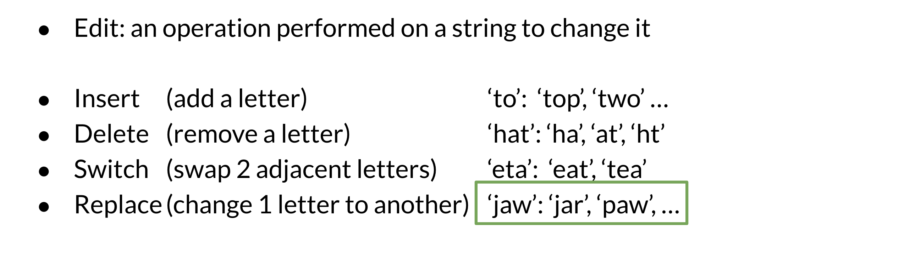
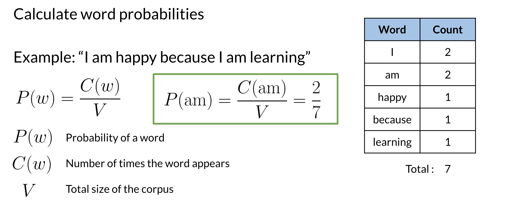
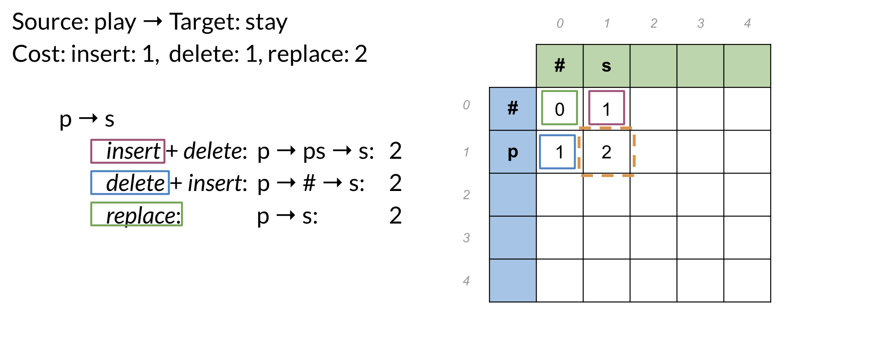
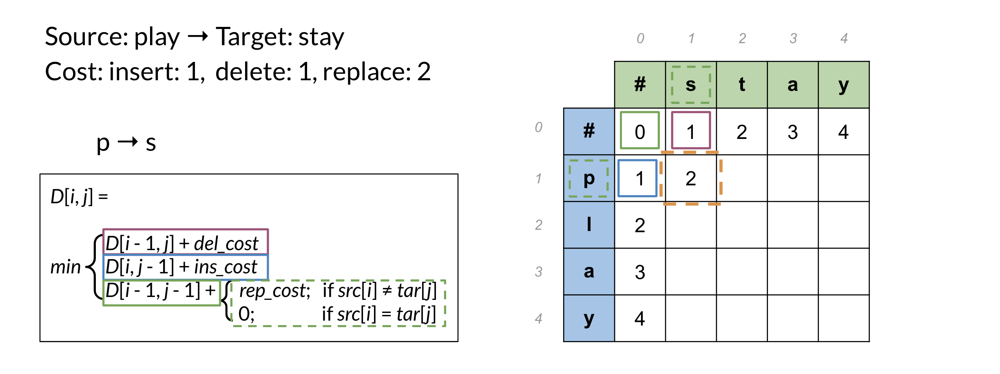
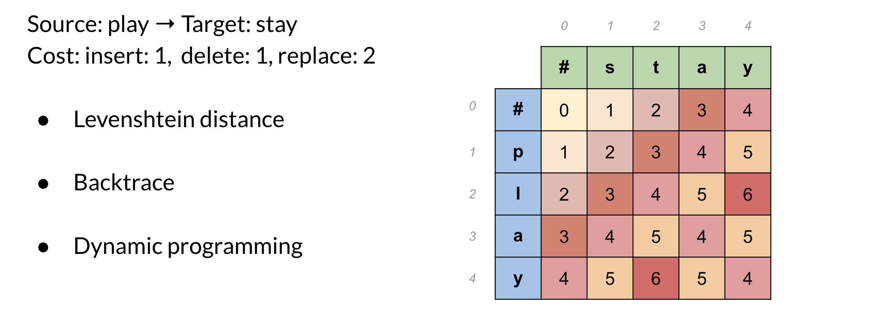

To implement autocorrect in this week's assignment, you have to follow these steps:

- Identify a misspelled word
- Find strings n edit distance away: (these could be random strings)
- Filter candidates: (keep only the real words from the previous steps)
- Calculate word probabilities: (choose the word that is most likely to occur in that context)

Minimum edit distance allows you to:

- Evaluate similarity between two strings
- Find the minimum number of edits between two strings
- Implement spelling correction, document similarity, machine translation, DNA sequencing, and more

## Minimum edit distance algorithm

